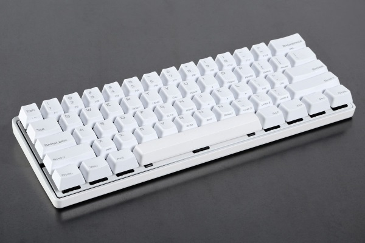
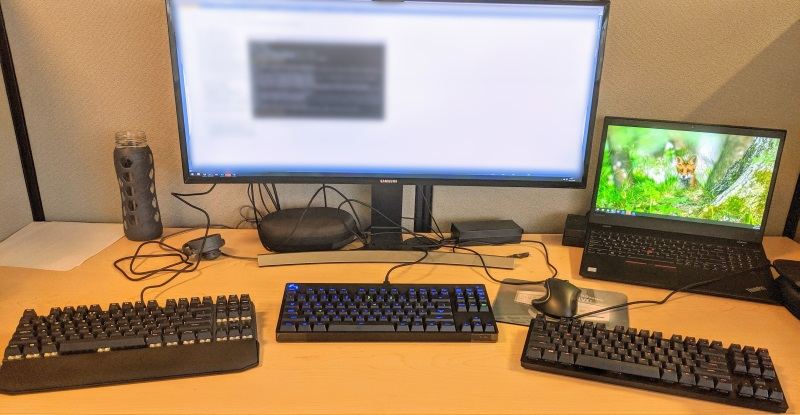
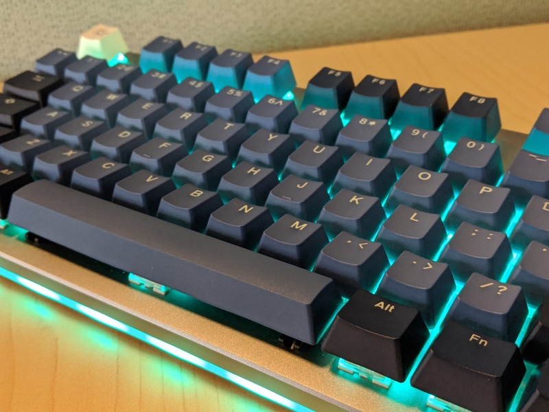

Title: Keyboard
Published: 
Tags: 
---
I have become a keyboard nerd, apparently.  Not that I [wasn't already](https://kevin-berridge.blogspot.com/2007/10/tools-of-trade-keyboard.html), [I guess](https://kevin-berridge.blogspot.com/2007/11/keyboard-follow-up.html), but I've just taken it to a different level.  What happened is one of my friends and coworkers recently built a mechanical keyboard, which then flaked out due to cheap parts, so he bought a [Vortex Pok3r 60% Mechanical board](https://mechanicalkeyboards.com/shop/index.php?l=product_detail&p=3630).

If I was aware of boards like this before, I'd never taken them seriously.  But when my friend got into it I took notice.  And, wow, there's a whole freaking world out there!

Turns out, there's a bunch of dimensions to keyboards these days, each rich with options:
  
- Keyboard layout: which includes how many keys and where they're placed
- Mechanical (or pseudo mechanical) Switches: which mostly determines how pressing a key feels
- Keycaps: which also affects the feel, but is mostly about aesthetics
- Programmability: custom key mappings, on different layers (like while FN is held down), and macros (one key maps to a whole sequence of key presses)

When I got into this I was on my second Microsoft Natural Ergonomic Keyboard 4000, which I have always loved.  It is comfortable.  But mine was getting old, and typing on it was starting to feel more like fighting with it.  I don't know why exactly, perhaps the membrane is starting to wear in ways that just make the key presses feel unreliable, which has led me to really pound the crap out of the keys to make sure I'm being heard.

As I started learning about this stuff I quickly realized it was going to require some hands on experience so after getting an initial sense of what to expect, I went to [MicroCenter](https://www.microcenter.com/) and I came home with three boards to try:

  - [Logitech G Pro](https://www.logitechg.com/en-us/products/gaming-keyboards/pro-mechanical-gaming-keyboard.html#920-009388)
  - [Razer Huntsman Tournament Edition](https://www.razer.com/gaming-keyboards-keypads/razer-huntsman-tournament-edition?utm_source=bing&utm_medium=search-brand&utm_campaign=190913_RS_TXN_BTM_US_EGR-huntsman_TR&msclkid=7aff6469edfa144acfd0398d638c8f05)
  - [Cooler Master MK730](https://www.coolermaster.com/catalog/peripheral/keyboards/mk730/)

I decided to start out with the "10-key less" layout, which is a regular keyboard layout minus the number pad.  Starting here meant I could actually try some boards at big box stores.

Then it was all about the switches!

  - Logitech Pro: Logitech Romer G
  - Razer Huntsman: Razer Linear Red Optical
  - Cooler Master: Cherry Red

Initially my thinking was I wanted the "fastest" possible typing experience, which from what I read meant I'd want linear switches, not tactile switches.  Linear switches have smooth travel all the way to the bottom while tactile switches have a little extra bump in the middle.  Gamers tend to like linear switches, seemingly because they think they are faster, while the conventional wisdom is that tactile switches are better for typing.  The third switch classification is "clicky" which are tactile and have an audible click, I had zero interest in this, both because I work in an office and because I think it sounds terrible.  Most of the advice in this product space is coming from gamers and is about gaming, even if that isn't explicitly stated.  I'm not going to be using this board for gaming, I'm going to use it for programming.  Which is more like regular typing than gaming, but also different.  So it was difficult to find much advice I felt I could really rely on.  So that said, here's what I thought about these three boards.

I **loved** the Huntsman.  I liked the look, I liked the shape and texture of the keycaps, I liked the font on the keycaps.  Aesthetically it was great.  Also, I liked how insanely fast the keys are.  But it is **very loud**.  And the keys **are** insanely sensitive.  I had a coworker try it, and he was accidentally hitting keys just by positioning his fingers over the keys, that's how sensitive it is.  I was able to type on it, but I had to be outrageously careful and I had a higher error rate than normal.  So that crossed it off the list.

Aesthetically, I really didn't like the Logitech Pro.  But, I totally liked the feel of its switches.  They were a tiny bit tactile, but they had early actuation, so they still felt fast, and they just felt familiar and nice.  In hindsight I suppose that's because they were the most similar to rubber dome keyboards (normal non-mechanical style boards) of the ones I tried.

Finally, the Cooler Master, which I very much thought was what I'd end up sticking with.  Very nice looking, and the Cherry Red switches really grew on me the longer I used them.  They had the longest actuation travel of the three, which I felt was noticeable, but I don't think it actually made my typing any slower, which ended up being an important observation.

At this point, I'm liking the CM board overall, but there's something about the Logitech switches I prefer.  Maybe it's that they are tactile?  So I head back to MicroCenter to return the two I've ruled out, I'll try some Cherry Browns (tactile) while I'm there, but I'm fully expecting to come home with the CM still.

But that's not what happens.  As soon I try out the Browns, which the first time I went I didn't like, I immediately realize tactile is better.  But I don't really love the Browns.  So, I return all 3 boards and now I'm going to have no choice but to go outside the big box stores and get into the deeper ranks of switches.

So, I start gathering data and I make a table:

| Name                            | Type    | Actuation | Travel | Force  | Life |
|---------------------------------|---------|-----------|--------|--------|------|
| Razer Linear Optical Red        | Linear  | 1.0mm     | ?      | 40     | 100M |
| Logitech Romer G Tactile        | Tactile | 1.5mm     | 3.2mm  | 45gf   | 70M  |
| Cherry Red                      | Linear  | 2mm       | 4mm    | 45     | 50M  |
| Cherry Speed Silver             | Linear  | 1.2mm     | 3.4mm  | 45     | 50M  |
| Kailh Speed Copper              | Tactile | 1.1mm     | 3.6mm  | 45/30  | 70M  |
| Kailh BOX Brown                 | Tactile | 1.8mm     | 3.6mm  | 45     | 80M  |
| Kailh Pro Purple                | Tactile | 1.7mm     | 3.6mm  | 50     | 70M  |
| Kailh Speed Silver              | Linear  | 1.3mm     | 3.5mm  | 27     |      |
| Cherry Silent Red               | Linear  | 1.9mm     | 3.7mm  | 45     | 50M  |
| Cherry Brown                    | Tactile | 2mm       | 4mm    | 45/37  | 50M  |
| Razer Orange                    | Tactile | 1.9mm     | 4mm    | 55     | 80M  |
| Gateron Silent Brown            | Tactile | 2mm       | 4mm    | 45     | 50M  |
| Gateron Brown                   | Tactile | 2mm       | 4mm    | 55     | 50M  |
| Toper                           | Tactile | 2mm       | 4mm    | 30-55  |      |
| Cherry Clear                    | Tactile | 2mm       | 4mm    | 65     |      |
| Halo/Hako Clear                 | Tactile | 1.95mm    | 3.6mm  | 65/50/78  | 80M  |
| Halo/Hako True                  | Tactile | 1.9mm     | 3.6mm  | 60/52/100 | 80M  |
| Hako Violet                     | Tactile |           |        |        |      |
| Outemu Ice Light Purple         | Tactile |           |        |        |      |
| Purple Zealios                  | Tactile |           |        |        |      |

Now, my experience so far is that I like the tactility, and I think I like it because it provides almost subliminal feedback that keypress has happened ("actuation").  And importantly, on a mechanical switch, the keypress is heard BEFORE you hit the bottom.  In fact, as you can see in the table above, it's generally somewhere in the middle.  So if the total travel in 4mm, the actuation is around 2mm.  That last 2mm of travel then isn't doing anything, the keypress has already happened.  So if I want to type quickly and softly (both in terms of volume and finger pressure), then I want to learn to not push the key all the way down ("bottoming out"), and instead feel that tactile feedback and turn around.

Is this a ridiculous level of analysis for something as mundane as typing?  Probably, but that's what has turned this into a hobby now!

My question at this point was, is that little tactile bump enough feedback to actually do this, especially after I've been smashing on my rubber dome keys for so many years?  And this line of thought ultimately led me to the [Hako Trues](https://input.club/the-comparative-guide-to-mechanical-switches/tactile/hako-true/).  These switches have a tactile bump at 1.9mm, and travel to 3.6mm.  But, the amount of force required to push the key down ramps WAY UP after the tactile bump from 52gf to 100gf.  So not only do you get the tactile feedback, you also get the feedback of the key getting harder and harder to press.  So, my hope is, this will help to train me to not bottom out the keys.

However, this was also a RADICAL departure from another metric I'd been assuming would be important for typing speed which was the force required to actuate the key.  On the Logitech Romer G's for example, that was 45gf, on the Hako True's it's 60gf!  That is a significant and noticeable difference.  

I'd have been VERY concerned about this, but fortunately for me my friend with the Vortex Pok3r had Cherry Clear switches on it, which also actuate at 60gf, and he let me try it out, and I was quite happy to find they didn't feel slow at all.

So I'm really interested in trying out the Hako Trues, but how?  First off, I don't think I can find a board that ships with them installed, and even if I could, if I didn't like them I'd be dealing with return fees and return shipping, and that's just no fun at all.  One option is keyboards that have hot swap-able sockets for the switches, so you can change them out.  And as fortune would have it Drop started selling the [Drop CTRL keyboard](https://drop.com/buy/drop-ctrl-mechanical-keyboard) with hot swap-able switches!  And its a low profile board (the case, not the caps) like the CM and Razer were too, so I like it's look.

So that's what I did:

That's my new [Drop CTRL](https://drop.com/buy/drop-ctrl-mechanical-keyboard) with [Hako True switches](https://input.club/the-comparative-guide-to-mechanical-switches/tactile/hako-true/) and [Ducky Good in Blue keycaps](https://www.duckychannel.com.tw/en/Ducky-PBT-Double-shot-Good-in-Blue-keycap).  So far, I like it.  I still have to remind myself to not bottom out the keys.  And when I forget, it does feel like a lot of work to type on.  But when I remember, it feels light and fast, like just whispering over the keys.  Its been a little over 2 weeks since I got it and plugged it all together now.  I'm getting more and more used to it, and I'll give it at least another 2 weeks before I do anymore tweaks.  But, that said, I think I'll probably go back to that table of switches and look into getting some switches with VERY low actuation force, like maybe the Kailh Speed Silvers, to use for the modifier keys.  Especially for left Shift and Ctrl.  Holding those down with my left pinky finger at 100gf IS hard.  Because when you are pressing and holding a key in order to type a short cut key "chord" (like ctrl+s, or ctrl+shift+f5) you pretty much have to bottom it out.  And that's the beauty of a hot swap-able board, I can mix and match!